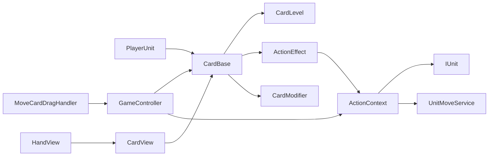

# Card Architecture

## 概要

カードは「カード情報」と「実行する効果」を分離して管理する。

- `CardBase`: 名前、説明、コスト、レベル、効果、エンチャントを保持する。
- `ActionEffect`: カードや敵行動から実行される効果の基底クラス。
- `ActionContext`: 効果の実行に必要な使用者、対象座標、移動サービスを保持する。
- `CardModifier`: カードを追加強化するための基底クラス。
- `CardView` / `HandView`: カード情報の表示のみを担当する。

カード固有クラスは `cXxx`、効果クラスは `eXxx` の形式で命名する。

## 構成

```text
Assets/Cards/
├── Core/            CardBase
├── Card/            cMove、cPunch、cIgnite などのカード定義
├── Modifiers/       CardModifier 基底クラス
├── CardModifiers/   mMove、mNone などの具体的な修飾
├── VOs/             CardLevel
└── Views/           CardView、HandView

Assets/Actions/
├── Core/            ActionContext
└── Effects/         ActionEffect と eMove、eLineAttack、ePositionAttack などの効果
```

## 依存関係



依存方向の原則は次のとおり。

- 具体カードは `CardBase` を継承し、必要な `ActionEffect` を生成する。
- `ActionEffect` は具体カードを参照しない。
- Viewはカード情報を表示するが、効果ロジックを持たない。
- `GameController` がカード使用条件を判定し、効果実行を仲介する。

## カード使用フロー

1. `PlayerUnit` が `CardBase` の一覧を保持する。
2. `HandView` が各カードを `CardView` にバインドして表示する。
3. カードのドロップ操作から `GameController.UseCardAtDropScreenPosition` を呼ぶ。
4. `GameController` がターン、使用回数、マナ、対象座標を検証する。
5. `ActionContext` を生成する。
6. `CardBase.Effects` を順番に呼び、各 `ActionEffect.Execute` を実行する。
7. コストを消費し、盤面とUIを更新する。

## CardBaseの制約

`Enchants` 以外は生成時に必須とする。

- `CardName`: `null`、空文字を禁止。
- `Description`: `null`、空文字を禁止。
- `Level`: `null` を禁止。
- `Effects`: `null`、空リスト、`null` 要素を禁止。
- `Enchants`: 省略可能。省略時は空リストになる。

レベルによって効果値が変化するカードは、`LevelUp` / `LevelDown` 後に説明文と効果インスタンスを更新する。

## ActionEffectの方針

カードや敵行動の具体的な処理は `ActionEffect` の派生クラスに実装する。

- `eMove`: 対象方向への移動。
- `eLineAttack`: 射程と命中方式を指定する直線攻撃。
- `ePositionAttack`: 指定座標にいる対象への攻撃。
- `eIgnite`: 射程内のマスへの炎上付与。

`eLineAttack` は射程によって近距離と遠距離を表現し、`HitType.FirstTargetOnly` と `HitType.Penetrating` で貫通の有無を切り替える。使用者の位置に依存せず指定座標だけを攻撃する場合は `ePositionAttack` を使用する。

## 新規カード追加手順

1. `Card/Card/cXxx.cs` を作り、`CardBase` を継承する。
2. 必要なら `Actions/Effects/eXxx.cs` を作り、`ActionEffect` を継承する。
3. カードのコンストラクタで1つ以上の効果を `Effects` に設定する。
4. レベル依存値がある場合は `LevelUp` / `LevelDown` で効果を更新する。
5. 使用可能にする場合は、カードを生成するデッキまたはユニットのカード一覧へ追加する。

## 現在の注意点

- `CardModifier` は保持・追加・削除できるが、現在のカード実行フローでは各フックが呼ばれていない。
- `ActionEffect.Execute` は既定実装が空のため、派生クラスでのオーバーライド忘れをコンパイル時には検出できない。
- カード使用と効果実行の調停が `GameController` に集中しているため、規模拡大時には専用サービスへの分離を検討する。
